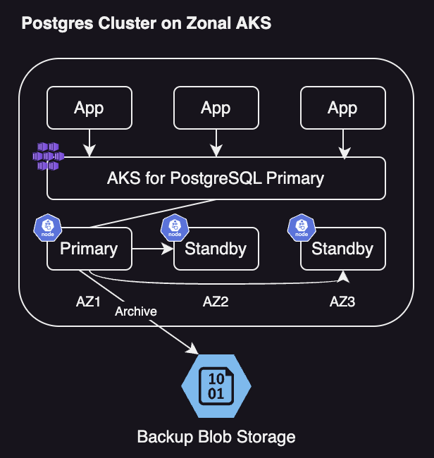
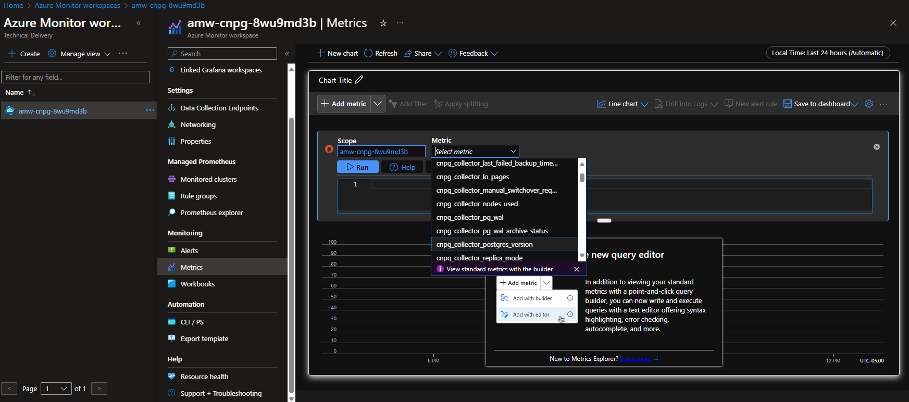

# Deploying a Highly-Available PostgreSQL Cluster on AKS using the Azure CLI

In this guide, you will deploy a highly-available PostgreSQL cluster that spans multiple Azure availability zones. You will walk through the steps required to set up the PostgreSQL cluster running on [Azure Kubernetes Service](https://learn.microsoft.com/en-us/azure/aks/what-is-aks) (AKS) and perform basic Postgres operations such as backup and restore.

## Before you begin

This guide assumes a basic understanding of Kubernetes concepts. For more information, see [Kubernetes core concepts for Azure Kubernetes Service (AKS)](/azure/aks/concepts-clusters-workloads). You will also need a basic understand of [PostgreSQL](https://www.postgresql.org/).

- [!INCLUDE [quickstarts-free-trial-note](../../../includes/quickstarts-free-trial-note.md)]

You will need **Owner** or **User Access Administrator** and **Contributor** [Azure built-in role](/azure/role-based-access-control/built-in-roles) on a subscription in your Azure account.

[!INCLUDE [azure-cli-prepare-your-environment-no-header.md](~/reusable-content/azure-cli/azure-cli-prepare-your-environment-no-header.md)]

## Prerequisites

- [Azure CLI v2.56](/cli/azure/install-azure-cli) or later
- [Azure Kubernetes Service (AKS) preview extension](/azure/aks/draft#install-the-aks-preview-azure-cli-extension)
- [jq v1.5](https://jqlang.github.io/jq/) or later
- [kubectl 1.21.0](https://kubernetes.io/docs/tasks/tools/install-kubectl/) or later
- [Helm v3.0.0](https://helm.sh/docs/intro/install/) or later
- [openssl 3.3.0](https://www.openssl.org/) or later
- [Visual Studio Code](https://code.visualstudio.com/Download) or equivalent
- [Krew 0.4.4](https://krew.sigs.k8s.io/) or later
- [Kubectl CNPG Plugin](https://cloudnative-pg.io/documentation/current/kubectl-plugin/#using-krew)

## Objectives

In this guide, you will learn how to:

- Use Azure CLI to create a multi-zone AKS cluster.
- Deploy a highly-available PostgreSQL cluster and database using the [CloudNativePG](https://cloudnative-pg.io/) (CPNG) operator.
- Set up monitoring for PostgreSQL using Prometheus and Grafana.
- Deploy a sample dataset to the PostgreSQL database.
- Perform PostgreSQL and AKS cluster upgrades.
- Simulate a cluster interuption and PostgreSQL replica failover.
- Perform backup and restore of the PostgreSQL database.

## Deployment Architecture

The diagram below illustrates a PostgreSQL cluster setup with a primary and read replicas for a total of three replicas, managed by the CNPG operator. The architecture provides high availability Postgres running on an Azure Kubernetes Service cluster that is able to withstand a zone outage by failing over across replicas.

Backups are stored on Azure Blob Storage to provide another way of restoring the database in the event there is an issue with streaming replication from the primary replica.



> [!NOTE]
> In the spirit of the Unix philosophy of "do one thing, and do it well" along with cloud native principles the CNPG operator supports one and only one database per cluster. For applications that require data seperation at the database level please plan accordingly.

## Create and Deploy Infrastructure

```bash
export SUFFIX=$(cat /dev/urandom | LC_ALL=C tr -dc 'a-z0-9' | fold -w 8 | head -n 1)
export LOCAL_NAME="cnpg"
export TAGS="owner=user"
export RESOURCE_GROUP_NAME="rg-${LOCAL_NAME}-${SUFFIX}"
export PRIMARY_CLUSTER_REGION="eastus"
export AKS_PRIMARY_CLUSTER_NAME="aks-primary-${LOCAL_NAME}-${SUFFIX}"
export AKS_PRIMARY_MANAGED_RG_NAME="rg-${LOCAL_NAME}-primary-aksmanaged-${SUFFIX}"
export AKS_PRIMARY_CLUSTER_FED_CREDENTIAL_NAME="pg-primary-fedcred1-${LOCAL_NAME}-${SUFFIX}"
export AKS_PRIMARY_CLUSTER_PG_DNSPREFIX=$(echo $(echo "a$(openssl rand -hex 5 | cut -c1-11)"))
export AKS_UAMI_CLUSTER_IDENTITY_NAME="mi-aks-${LOCAL_NAME}-${SUFFIX}"
export AKS_CLUSTER_VERSION="1.27"
export PG_NAMESPACE="cnpg-database"
export PG_SYSTEM_NAMESPACE="cnpg-system"
export PG_PRIMARY_CLUSTER_NAME="pg-primary-${LOCAL_NAME}-${SUFFIX}"
export PG_PRIMARY_STORAGE_ACCOUNT_NAME="hacnpgpsa${SUFFIX}"
export PG_STORAGE_BACKUP_CONTAINER_NAME="backups"
export ENABLE_AZURE_PVC_UPDATES="true"
export MY_PUBLIC_CLIENT_IP=$(dig +short myip.opendns.com @resolver3.opendns.com)
```

## Required Extensions

Install extensions to provide additional functionality to the Azure CLI for managing Kubernetes clusters and querying Azure resources using the resource graph.

```bash
az extension add --upgrade --name k8s-extension --yes --allow-preview false
az extension add --upgrade --name amg --yes --allow-preview false
```

## Create resource group

Create a resource group that will contain all Azure infrastructure resources described in the architeture diagram earlier.

```bash
az group create \
  --name $RESOURCE_GROUP_NAME \
  --location $PRIMARY_CLUSTER_REGION \
  --tags $TAGS \
  --output tsv --query 'properties.provisioningState'
```

## Create User Assigned Managed Identity

Create a User Assigned Managed Identity (UAMI) to let the CNPG Postgres use AKS Workload Identity to access Azure Blob Storage. This will allow the PostgreSQL cluster on AKS to connect to Azure Blob Storage without a secret.

```bash
AKS_UAMI_WI_IDENTITY=$(az identity create \
    --name $AKS_UAMI_CLUSTER_IDENTITY_NAME \
    --resource-group "$RESOURCE_GROUP_NAME" \
    --output json)

export AKS_UAMI_WORKLOAD_OBJECTID=$( \
    echo "${AKS_UAMI_WI_IDENTITY}" | jq -r '.principalId')
export AKS_UAMI_WORKLOAD_RESOURCEID=$( \
    echo "${AKS_UAMI_WI_IDENTITY}" | jq -r '.id')
export AKS_UAMI_WORKLOAD_CLIENTID=$( \
    echo "${AKS_UAMI_WI_IDENTITY}" | jq -r '.clientId')

echo "ObjectId: $AKS_UAMI_WORKLOAD_OBJECTID"
echo "ResourceId: $AKS_UAMI_WORKLOAD_RESOURCEID"
echo "ClientId: $AKS_UAMI_WORKLOAD_CLIENTID"
```

The ObjectID is a unique identifier for Client ID (also known as Application ID) which uniquely identifies a security principal of type Application within the Entra ID tenant. The ResourceID is a unique identifier to manage and locate a resource in Azure. These values are required to enabled AKS Workload Identity.

The CNPG operator automatically generates a service account called “postgres” that you will use later in the guide to create a federated credential that will enable OAuth access from Postgres to Azure Storage.

## Create storage account in primary region

Create a storage acccount (object storage) that will be used to store Postgres backups in the primary region. Two types of backups will be stored in the storage account: Write Ahead Logs (WAL) and regular Postgres on-demand and scheduled backups.

```bash
az storage account create \
  --name $PG_PRIMARY_STORAGE_ACCOUNT_NAME \
  --resource-group $RESOURCE_GROUP_NAME \
  --location $PRIMARY_CLUSTER_REGION \
  --sku Standard_ZRS \
  --kind StorageV2 \
  --output tsv --query 'provisioningState'

az storage container create \
  --name $PG_STORAGE_BACKUP_CONTAINER_NAME \
  --account-name $PG_PRIMARY_STORAGE_ACCOUNT_NAME \
  --auth-mode login > /dev/null
```

## Assign RBAC to storage accounts

To enable backups, the Postgres cluster needs to read and write to an object store. The PostgreSQL cluster running on AKS will use a Workload Identity to access the storage account via the CNPG operator configuration parameter [inheritFromAzureAD](https://cloudnative-pg.io/documentation/1.23/appendixes/object_stores/#azure-blob-storage). Assign the built-in Azure RBAC Role "Storage Blob Data Contributor" to the ObjectID using the storage account ResourceID scope for the UAMI created earlier that will be associated with the managed identity for each AKS cluster.

```bash
export STORAGE_ACCOUNT_PRIMARY_RESOURCE_ID=$(az storage account show \
    --name $PG_PRIMARY_STORAGE_ACCOUNT_NAME \
    --resource-group $RESOURCE_GROUP_NAME \
    --query "id" \
    --output tsv)

echo $STORAGE_ACCOUNT_PRIMARY_RESOURCE_ID

az role assignment create \
  --role "Storage Blob Data Contributor" \
  --assignee-object-id $AKS_UAMI_WORKLOAD_OBJECTID \
  --assignee-principal-type ServicePrincipal \
  --scope $STORAGE_ACCOUNT_PRIMARY_RESOURCE_ID \
  --output tsv --query 'id'
```

## Setup monitoring infrastructure

Deploy an instance of Azure Managed Grafana and an Azure Monitor Workspace to enable monitoring of the Postgres cluster. References to the created monitoring infrastructure are stored for input into the AKS cluster creation later in the guide.

>Note: Azure Managed Grafana instances and AKS clusters are billed independently. If you would like to know more about terms and pricing, [visit this link](https://azure.microsoft.com/en-us/pricing/details/managed-grafana/).

Please note this step may take some time to complete.

```bash
export GRAFANA_PRIMARY="grafana-${LOCAL_NAME}-${SUFFIX}"

export GRAFANA_RESOURCE_ID=$(az grafana create \
  --resource-group $RESOURCE_GROUP_NAME \
  --name $GRAFANA_PRIMARY \
  --zone-redundancy Enabled \
  --tags $TAGS \
  --query 'id' \
  --output tsv)

echo $GRAFANA_RESOURCE_ID

export AMW_PRIMARY="amw-${LOCAL_NAME}-${SUFFIX}"

export AMW_RESOURCE_ID=$(az monitor account create \
  --name $AMW_PRIMARY \
  --resource-group $RESOURCE_GROUP_NAME \
  --tags $TAGS \
  --output tsv --query 'id')

echo $AMW_RESOURCE_ID

export ALA_PRIMARY="ala-${LOCAL_NAME}-${SUFFIX}"

export ALA_RESOURCE_ID=$(az monitor log-analytics workspace create \
  --resource-group $RESOURCE_GROUP_NAME \
  --workspace-name $ALA_PRIMARY \
  --output tsv --query 'id')

echo $ALA_RESOURCE_ID
```

## Create the AKS cluster to host the Postgres cluster

Create the multi-zone Azure Kubernetes Service (AKS) cluster with system nodepool. The AKS cluster will host the PostgreSQL cluster primary replica and two standby replicas each aligned to a different availability zone to enable zonal redundancy.

Please note this step may take some time to complete.

```bash
export SYSTEM_NODE_POOL_VMSKU="Standard_D2s_v3"
export USER_NODE_POOL_NAME="postgres"
export USER_NODE_POOL_VMSKU="Standard_D4s_v3"

az aks create \
    --name $AKS_PRIMARY_CLUSTER_NAME \
    --tags $TAGS \
    --resource-group $RESOURCE_GROUP_NAME \
    --location $PRIMARY_CLUSTER_REGION \
    --generate-ssh-keys \
    --node-resource-group $AKS_PRIMARY_MANAGED_RG_NAME \
    --enable-managed-identity \
    --assign-identity $AKS_UAMI_WORKLOAD_RESOURCEID \
    --network-plugin azure \
    --network-plugin-mode overlay \
    --network-dataplane cilium \
    --nodepool-name systempool \
    --enable-oidc-issuer \
    --enable-workload-identity \
    --node-count 2 \
    --node-vm-size $SYSTEM_NODE_POOL_VMSKU \
    --enable-azure-monitor-metrics \
    --azure-monitor-workspace-resource-id $AMW_RESOURCE_ID \
    --grafana-resource-id $GRAFANA_RESOURCE_ID \
    --zones 1 2 3
```

Add a user nodepool to host the Postgres cluster. Using a seperate nodepool allows for control over the Azure VM SKUs used for Postgres and the AKS system pool to optimize performance and costs. A label is applied to the user nodepool that may be referenced for node selection when the CNPG operator is deployed later in the guide.

```bash
az aks nodepool add \
    --resource-group $RESOURCE_GROUP_NAME \
    --cluster-name $AKS_PRIMARY_CLUSTER_NAME \
    --name $USER_NODE_POOL_NAME \
    --node-count 3 \
    --node-vm-size $USER_NODE_POOL_VMSKU \
    --zones 1 2 3 \
    --labels workload=postgres
```

>Note: If you recieve an error message "(OperationNotAllowed) Operation is not allowed: Another operation (Updating) is in progress, please wait for it to finish before starting a new operation." when adding the AKS nodepool please wait a few moments for AKS cluster operations to complete and repeat the az aks nodepool add command above.

## Connect to the AKS cluster and create namespaces

Obtain the credentials for the Azure Kubernetes Service (AKS) cluster that was just created. These credentials serve as the keys that allow you to authenticate and interact with the cluster. Once connected, two namespaces will be created:

1. A namespace for the CNPG controller manager services
1. A namespace for the Postgres cluster and related services

```bash
az aks get-credentials \
    --resource-group $RESOURCE_GROUP_NAME \
    --name $AKS_PRIMARY_CLUSTER_NAME

kubectl create namespace $PG_NAMESPACE --context $AKS_PRIMARY_CLUSTER_NAME
kubectl create namespace $PG_SYSTEM_NAMESPACE --context $AKS_PRIMARY_CLUSTER_NAME
```

## Update Monitoring Infrastructure

The Azure Monitor Workspace (Managed Prometheus) and Azure Managed Grafana are automatically linked to the AKS cluster during the aks create operation for metrics and visualization. For log collection an additional step is needed to enabled AKS Container Insights.

```bash
az aks enable-addons \
    --addon monitoring \
    --name $AKS_PRIMARY_CLUSTER_NAME \
    --resource-group $RESOURCE_GROUP_NAME \
    --workspace-resource-id $ALA_RESOURCE_ID
```

Validate that managed prometheus is scraping metrics and container insights is ingesting logs from the AKS cluster by inspecting the DaemonSet.

```bash
kubectl get ds ama-metrics-node \
    --context $AKS_PRIMARY_CLUSTER_NAME \
    --namespace=kube-system

kubectl get ds ama-logs \
    --context $AKS_PRIMARY_CLUSTER_NAME \
    --namespace=kube-system

az aks show \
    --resource-group $RESOURCE_GROUP_NAME \
    --name $AKS_PRIMARY_CLUSTER_NAME \
    --query addonProfiles
```

Output should resemble the following. There should be six (6) nodes with three (3) for the system nodepool and three (3) for the postgres nodepool. For container insights validate that the omsagent is enabled.

```bash
NAME               DESIRED   CURRENT   READY   UP-TO-DATE   AVAILABLE   NODE SELECTOR
ama-metrics-node   6         6         6       6            6           <none>       

NAME               DESIRED   CURRENT   READY   UP-TO-DATE   AVAILABLE   NODE SELECTOR
ama-logs           6         6         6       6            6           <none>       

{
  "omsagent": {
    "config": {
      "logAnalyticsWorkspaceResourceID": "/subscriptions/00000000-0000-0000-0000-000000000000/resourceGroups/rg-cnpg-9vbin3p8/providers/Microsoft.OperationalInsights/workspaces/ala-cnpg-9vbin3p8",
      "useAADAuth": "true"
    },
    "enabled": true,
    "identity": null
  }
}
```

## Create Public Static IP for Postgres cluster ingress

To validate deployment of the Postgres cluster and use client Postgres tooling such as psql and PgAdmin it is necessary to expose the primary and read-only replicas to ingress. Create an Azure Public IP resource that will be later supplied to an Azure Load Balancer to expose Postgres endpoints for query.

```bash
export AKS_PRIMARY_CLUSTER_NODERG_NAME=$(az aks show \
  --name $AKS_PRIMARY_CLUSTER_NAME \
  --resource-group $RESOURCE_GROUP_NAME \
  --query nodeResourceGroup -o tsv)

echo $AKS_PRIMARY_CLUSTER_NODERG_NAME

export AKS_PRIMARY_CLUSTER_PUBLICIP_NAME="$AKS_PRIMARY_CLUSTER_NAME-pip"

az network public-ip create \
    --resource-group $AKS_PRIMARY_CLUSTER_NODERG_NAME \
    --name $AKS_PRIMARY_CLUSTER_PUBLICIP_NAME \
    --sku Standard \
    --zone 1 2 3 \
    --allocation-method static

export AKS_PRIMARY_CLUSTER_PUBLICIP_ADDRESS=$(az network public-ip show \
    --resource-group $AKS_PRIMARY_CLUSTER_NODERG_NAME \
    --name $AKS_PRIMARY_CLUSTER_PUBLICIP_NAME \
    --query ipAddress --output tsv)

echo $AKS_PRIMARY_CLUSTER_PUBLICIP_ADDRESS

export AKS_PRIMARY_CLUSTER_NODERG_NAME_SCOPE=$(az group show --name \
    $AKS_PRIMARY_CLUSTER_NODERG_NAME \
    --query id -o tsv)

echo $AKS_PRIMARY_CLUSTER_NODERG_NAME_SCOPE

az role assignment create \
    --assignee-object-id ${AKS_UAMI_WORKLOAD_OBJECTID} \
    --assignee-principal-type ServicePrincipal \
    --role "Network Contributor" \
    --scope ${AKS_PRIMARY_CLUSTER_NODERG_NAME_SCOPE}
```

## Install the CloudNativePG Operator in the AKS cluster

[Option A] Install the operator on the primary cluster using Helm

```bash
helm repo add cnpg https://cloudnative-pg.github.io/charts
helm upgrade --install cnpg \
  --namespace $PG_SYSTEM_NAMESPACE \
  --create-namespace \
  --kube-context=$AKS_PRIMARY_CLUSTER_NAME \
  cnpg/cloudnative-pg
```

[Option A] Verify the operator installation on the primary cluster

```bash
kubectl get deployment \
    --context $AKS_PRIMARY_CLUSTER_NAME \
    --namespace $PG_SYSTEM_NAMESPACE cnpg-cloudnative-pg
```

[Option B] Install the operator on the primary cluster using YAML manifest

```bash
kubectl apply --context $AKS_PRIMARY_CLUSTER_NAME \
    --namespace $PG_SYSTEM_NAMESPACE \
    --server-side -f \
    https://raw.githubusercontent.com/cloudnative-pg/cloudnative-pg/release-1.23/releases/cnpg-1.23.1.yaml
```

[Option B] Verify the operator installation on the primary cluster

```bash
kubectl get deployment \
    --namespace $PG_SYSTEM_NAMESPACE cnpg-controller-manager \
    --context $AKS_PRIMARY_CLUSTER_NAME
```

## Deploy Primary Postgres Cluster

The following sections detail the steps necessary to prepare and deploy a Postgres cluster using the CNPG operator.

### Create secret for bootstrap app user

Generate a secret for the Postgres app user that will be used to validate the Postgres deployment by interactive login for a bootstrap "app" user.

```bash
PG_DATABASE_APPUSER_SECRET=$(echo -n | openssl rand -base64 16)

kubectl create secret generic db-user-pass \
    --from-literal=username=app \
    --from-literal=password="${PG_DATABASE_APPUSER_SECRET}" \
    --namespace $PG_NAMESPACE \
    --context $AKS_PRIMARY_CLUSTER_NAME
```

Validate the secret was succesfully created.

```bash
kubectl get secrets db-user-pass --namespace $PG_NAMESPACE --context $AKS_PRIMARY_CLUSTER_NAME
```

### Set environment variables for Postgres cluster

Deploy config map to specify environment variables for the CNPG operator.

```bash
cat <<EOF | kubectl apply --context $AKS_PRIMARY_CLUSTER_NAME -n $PG_NAMESPACE -f -
apiVersion: v1
kind: ConfigMap
metadata:
  name: cnpg-controller-manager-config
data:
  ENABLE_AZURE_PVC_UPDATES: 'true'
EOF
```

### Install Prometheus Community for CNPG PodMonitor

The CNPG operator will automatically create PodMonitors for the CNPG instances using a set of default recording rules stored on the CNPG Github samples repo. In a production environment these rules would modified as needed.

```bash
helm repo add prometheus-community \
  https://prometheus-community.github.io/helm-charts

helm upgrade --install \
  -f https://raw.githubusercontent.com/cloudnative-pg/cloudnative-pg/main/docs/src/samples/monitoring/kube-stack-config.yaml \
  prometheus-community \
  prometheus-community/kube-prometheus-stack \
  --kube-context=$AKS_PRIMARY_CLUSTER_NAME
```

Verify that the pod monitor is created.

```bash
kubectl -n $PG_NAMESPACE \
    --context $AKS_PRIMARY_CLUSTER_NAME \
    get podmonitors.monitoring.coreos.com \
    $PG_PRIMARY_CLUSTER_NAME \
    -o yaml
```

### Prerequistes for CNPG AKS Workload Identity

Next create a federated credential for Postgres backup to allow CNPG to use AKS workload identity to authenticate to the storage account destination for backups. Note that the CNPG operator creates a Kubernetes service account with the same name as the cluster named used in the CNPG Cluster deployment manifest.

```bash
export AKS_PRIMARY_CLUSTER_OIDC_ISSUER="$(az aks show \
    --name $AKS_PRIMARY_CLUSTER_NAME \
    --resource-group $RESOURCE_GROUP_NAME \
    --query "oidcIssuerProfile.issuerUrl" -o tsv)"

az identity federated-credential create \
    --name $AKS_PRIMARY_CLUSTER_FED_CREDENTIAL_NAME \
    --identity-name $AKS_UAMI_CLUSTER_IDENTITY_NAME \
    --resource-group $RESOURCE_GROUP_NAME --issuer "${AKS_PRIMARY_CLUSTER_OIDC_ISSUER}" \
    --subject system:serviceaccount:"${PG_NAMESPACE}":"${PG_PRIMARY_CLUSTER_NAME}" \
    --audience api://AzureADTokenExchange

#"subject": "system:serviceaccount:cnpg-database:<clustername>"
```

### Deploy the Highly-Available Postgres cluster

Deploy Postgres cluster using the CNPG [Cluster](https://cloudnative-pg.io/documentation/1.23/cloudnative-pg.v1/#postgresql-cnpg-io-v1-ClusterSpec) custom resource definition.

Explanation of key properties set in the YAML deployment manifest for the Cluster CRD.

1. inheritedMetadata - CNPG operator specific. Metadata that will be inherited by all objects related to the Cluster.
1. annotation - service.beta.kubernetes.io/azure-dns-label-name - DNS label for use when exposing the read-write and read-only Postgres cluster endpoints later in the guide.
1. annotation - azure.workload.identity/use: "true" - Used to indicate that AKS should inject workload identity dependecies into the pods hosting the Postgres cluster instances.
1. topologySpreadConstraints - Require different zones and different nodes with label "workload=postgres"
1. resources - Request Guaranteed QoS. In a production environment these values are key for maximizing usage of the underlying Node VM and will vary based on the Azure VM SKU used.
1. bootstrap - CNPG operator specific. Initialize with empty app database.
1. storage / walStorage - CNPG operator specific. Used to define storage template for the PVCs using for data and log storage. It is also possible to specify storage for tablespaces to shard out for increased IOPs.
1. replicationSlots - CNPG operator specific. Enable replication slots for high availability.
1. postgresql - CNPG operator specific. Mapped settings for postgresql.conf, pg_hba.conf, pg_ident.conf config
1. serviceAccountTemplate - Contains the template needed to generate the service accounts. This is used to map the AKS federated identity credential to an Azure User Assigned Managed Identity to enable AKS Workload Identity authentication from the pods hosting the Postgres instances to external Azure resources.
1. barmanObjectStore - CNPG operator specific. The configuration for the barman-cloud tool suite using AKS Workload Identity for authentication to object store (Azure Blob Storage).

```bash
cat <<EOF | kubectl apply --context $AKS_PRIMARY_CLUSTER_NAME -n $PG_NAMESPACE -v 9 -f -
apiVersion: postgresql.cnpg.io/v1
kind: Cluster
metadata:
  name: $PG_PRIMARY_CLUSTER_NAME
spec:
  inheritedMetadata:
    annotations:
      service.beta.kubernetes.io/azure-dns-label-name: $AKS_PRIMARY_CLUSTER_PG_DNSPREFIX
    labels:
      azure.workload.identity/use: "true"

  instances: 3
  minSyncReplicas: 1
  maxSyncReplicas: 1

  topologySpreadConstraints:
  - maxSkew: 1
    topologyKey: topology.kubernetes.io/zone
    whenUnsatisfiable: DoNotSchedule
    labelSelector:
      matchLabels:
        cnpg.io/cluster: $PG_PRIMARY_CLUSTER_NAME

  affinity:
    nodeSelector:
      workload: postgres

  resources:
    requests:
      memory: '2Gi'
      cpu: 1.5
    limits:
      memory: '2Gi'
      cpu: 1.5

  bootstrap:
    initdb:
      database: appdb
      owner: app
      secret:
        name: db-user-pass
      dataChecksums: true

  storage:
    size: 2Gi
    pvcTemplate:
      accessModes:
        - ReadWriteOnce
      resources:
        requests:
          storage: 2Gi
      storageClassName: managed-csi-premium
      volumeMode: Filesystem

  walStorage:
    size: 2Gi
    pvcTemplate:
      accessModes:
        - ReadWriteOnce
      resources:
        requests:
          storage: 2Gi
      storageClassName: managed-csi-premium
      volumeMode: Filesystem

  monitoring:
    enablePodMonitor: true

  replicationSlots:
    highAvailability:
      enabled: true

  postgresql:
    parameters:
      # max_worker_processes: 64
    pg_hba:
      - host all all all scram-sha-256
  
  serviceAccountTemplate:
    metadata:
      annotations:
        azure.workload.identity/client-id: "$AKS_UAMI_WORKLOAD_CLIENTID"  
      labels:
        azure.workload.identity/use: "true"

  backup:
    barmanObjectStore:
      destinationPath: "https://${PG_PRIMARY_STORAGE_ACCOUNT_NAME}.blob.core.windows.net/backups"
      azureCredentials:
        inheritFromAzureAD: true

    retentionPolicy: '7d'
EOF
```

Validate primary postgres cluster creation. The CNPG Cluster config specified three instances which can be validated by viewing running pods once each instance is brought up and joined for replication. Be patient as it can take some time for all three instances to come online and join the cluster.

```bash
kubectl get pod --context $AKS_PRIMARY_CLUSTER_NAME -n $PG_NAMESPACE

#NAME                         READY   STATUS    RESTARTS   AGE
#pg-primary-cnpg-r8c7unrw-1   1/1     Running   0          4m25s
#pg-primary-cnpg-r8c7unrw-2   1/1     Running   0          3m33s
#pg-primary-cnpg-r8c7unrw-3   1/1     Running   0          2m49s
```

### Validate Prometheus PodMonitor is Running

The CNPG operator will automatically create a PodMonitor for the primary instance using the recording rules created during the Prometheus community installation performed earlier.

```bash
kubectl -n $PG_NAMESPACE \
    --context $AKS_PRIMARY_CLUSTER_NAME \
    get podmonitors.monitoring.coreos.com \
    $PG_PRIMARY_CLUSTER_NAME \
    -o yaml

# kind: PodMonitor
# metadata:
#  annotations:
#    cnpg.io/operatorVersion: 1.23.1
# ... <snip> ...
```

If you are using [Azure Monitor for Managed Prometheus](https://learn.microsoft.com/en-us/azure/azure-monitor/essentials/prometheus-metrics-overview), you will need to add another pod monitor using the custom group name because Managed Prometheus does not pick up the cutom resource definitions (CRDs) from the Prometheus community. Aside from the group name, the CRDs are the same. This allows pod monitors for Managed Prometheus to exist side by side with those that use the community pod monitor. If you are not using Managed Protheus, you can skip this. Create a new pod monitor:

```bash
cat <<EOF | kubectl apply --context $AKS_PRIMARY_CLUSTER_NAME -n $PG_NAMESPACE -f apply -f -
apiVersion: azmonitoring.coreos.com/v1
kind: PodMonitor
metadata:
  name: cnpg-cluster-metrics-managed-prometheus
  namespace: ${PG_NAMESPACE}
  labels:
    azure.workload.identity/use: "true"
    cnpg.io/cluster: ${PG_PRIMARY_CLUSTER_NAME}
spec:
  selector:
    matchLabels:
      azure.workload.identity/use: "true"
      cnpg.io/cluster: ${PG_PRIMARY_CLUSTER_NAME}
  podMetricsEndpoints:
    - port: metrics
```

Verify that the pod monitor is created (note the difference in the group name).

```bash
kubectl -n $PG_NAMESPACE \
    --context $AKS_PRIMARY_CLUSTER_NAME \
    get podmonitors.azmonitoring.coreos.com \
    $PG_PRIMARY_CLUSTER_NAME \
    -o yaml
```

Once you have deployed the Postgres cluster and the pod monitor, you can view the metrics using the Azure portal in an Azure Monitor workspace.




### Inspect the deployed Postgres cluster

Retrieve the AKS nodes and their respective zones to validate Postgres is spread across multiple availability zones.

```bash
kubectl get nodes \
    --context $AKS_PRIMARY_CLUSTER_NAME \
    -n $PG_NAMESPACE \
    -o json | jq '.items[] | {node: .metadata.name, zone: .metadata.labels."failure-domain.beta.kubernetes.io/zone"}'
```

The output will resemble the following with the available zone number shown for each node.

```json
{
    "node": "aks-postgres-15810965-vmss000000",
    "zone": "eastus-1"
}
{
    "node": "aks-postgres-15810965-vmss000001",
    "zone": "eastus-2"
}
{
    "node": "aks-postgres-15810965-vmss000002",
    "zone": "eastus-3"
}
{
    "node": "aks-systempool-26112968-vmss000000",
    "zone": "eastus-1"
}
{
    "node": "aks-systempool-26112968-vmss000001",
    "zone": "eastus-2"
}
```

### Connect to Postgres primary and create a sample dataset

Next create a table and insert some data into the app database that was created in the bootstrap section of the CNPG Cluster specification earlier. This data will be used to validate the backup and restore operations for the Postgres cluster.

```bash
kubectl cnpg psql $PG_PRIMARY_CLUSTER_NAME --namespace $PG_NAMESPACE

# Run the following PSQL commands to create a small dataset
# postgres=#

CREATE TABLE datasample (id INTEGER,name VARCHAR(255));
INSERT INTO datasample (id, name) VALUES (1, 'John');
INSERT INTO datasample (id, name) VALUES (2, 'Jane');
INSERT INTO datasample (id, name) VALUES (3, 'Alice');
SELECT COUNT(*) FROM datasample;

# Type \q to exit psql
```

### Connect to Postgres read-only replicas

Next login to a read replica and validate the sample dataset has been replicated.

```bash
kubectl cnpg psql --replica $PG_PRIMARY_CLUSTER_NAME --namespace $PG_NAMESPACE

#postgres=# 
SELECT pg_is_in_recovery();
# pg_is_in_recovery
#-------------------
# t
#(1 row)

#postgres=# 
SELECT COUNT(*) FROM datasample;
# count
#-------
#     3
#(1 row)

# Type \q to exit psql
```

### Setup on-demand and scheduled Postgres backups using Barman

To validate that the Postgres Cluster is able to now access the Azure storage account specified in the CNPG Cluster deployment mangifest, inspect whether the "Working WAL archiving" is reporting as "OK" via the cnpg kubectl extension as shown below.

```bash
kubectl cnpg status $PG_PRIMARY_CLUSTER_NAME 1 --context $AKS_PRIMARY_CLUSTER_NAME -n $PG_NAMESPACE

#Continuous Backup status
#First Point of Recoverability:  Not Available
#Working WAL archiving:          FAILING
#WALs waiting to be archived:    0
#Last Archived WAL:              000000010000000000000009   @   2024-06-05T13:39:23.597668Z
```

Next, perform an on-demand backup to Azure Storage which will also use the AKS Workload Identity integration setup previously.

```bash
export BACKUP_ONDEMAND_NAME="on-demand-backup-1"

cat <<EOF | kubectl apply --context $AKS_PRIMARY_CLUSTER_NAME -n $PG_NAMESPACE -v 9 -f -
apiVersion: postgresql.cnpg.io/v1
kind: Backup
metadata:
  name: $BACKUP_ONDEMAND_NAME
spec:
  method: barmanObjectStore
  cluster:
    name: $PG_PRIMARY_CLUSTER_NAME
EOF
```

Validate the status of the on-demand backup and observe that the cluster now has a first point of recoverability in the cnpg status output.

```bash
kubectl describe backup $BACKUP_ONDEMAND_NAME --context $AKS_PRIMARY_CLUSTER_NAME -n $PG_NAMESPACE

#Type    Reason     Age   From                   Message
#  ----    ------     ----  ----                   -------
#  Normal  Starting   6s    cloudnative-pg-backup  Starting backup for cluster pg-primary-cnpg-r8c7unrw
#  Normal  Starting   5s    instance-manager       Backup started
#  Normal  Completed  1s    instance-manager       Backup completed

kubectl cnpg status $PG_PRIMARY_CLUSTER_NAME 1 --context $AKS_PRIMARY_CLUSTER_NAME -n $PG_NAMESPACE

#Continuous Backup status
#First Point of Recoverability:  2024-06-05T13:47:18Z
#Working WAL archiving:          OK
```

Perform a scheduled backup for every hour at 15 minutes past the hour.

```bash
export BACKUP_SCHEDULED_NAME="scheduled-backup-1"

cat <<EOF | kubectl apply --context $AKS_PRIMARY_CLUSTER_NAME -n $PG_NAMESPACE -v 9 -f -
apiVersion: postgresql.cnpg.io/v1
kind: ScheduledBackup
metadata:
  name: $BACKUP_SCHEDULED_NAME
spec:
  # Backup once per hour
  schedule: "0 15 * ? * *"
  backupOwnerReference: self
  cluster:
    name: $PG_PRIMARY_CLUSTER_NAME
EOF
```

Validate the status of the scheduled backup.

```bash
kubectl describe scheduledbackup $BACKUP_SCHEDULED_NAME --context $AKS_PRIMARY_CLUSTER_NAME -n $PG_NAMESPACE
```

To view the backup files stored on Azure blob storage for the primary cluster, run the following command.

```bash
az storage blob list --account-name $PG_PRIMARY_STORAGE_ACCOUNT_NAME --container-name backups --query "[*].name" --only-show-errors 
```

Output resembles the following validating the backup was successful

```json
[
  "pg-primary-cnpg-r8c7unrw/base/20240605T134715/backup.info",
  "pg-primary-cnpg-r8c7unrw/base/20240605T134715/data.tar",
  "pg-primary-cnpg-r8c7unrw/wals/0000000100000000/000000010000000000000001",
  "pg-primary-cnpg-r8c7unrw/wals/0000000100000000/000000010000000000000002",
  "pg-primary-cnpg-r8c7unrw/wals/0000000100000000/000000010000000000000003",
  "pg-primary-cnpg-r8c7unrw/wals/0000000100000000/000000010000000000000003.00000028.backup",
  "pg-primary-cnpg-r8c7unrw/wals/0000000100000000/000000010000000000000004",
  "pg-primary-cnpg-r8c7unrw/wals/0000000100000000/000000010000000000000005",
  "pg-primary-cnpg-r8c7unrw/wals/0000000100000000/000000010000000000000005.00000028.backup",
  "pg-primary-cnpg-r8c7unrw/wals/0000000100000000/000000010000000000000006",
  "pg-primary-cnpg-r8c7unrw/wals/0000000100000000/000000010000000000000007",
  "pg-primary-cnpg-r8c7unrw/wals/0000000100000000/000000010000000000000008",
  "pg-primary-cnpg-r8c7unrw/wals/0000000100000000/000000010000000000000009"
]
```

### Restore on-demand backup to a new Postgres cluster

To restore the on-demand backup created earlier using the CNPG operator, restore the backup into a new instance using the bootstrap Cluster config. For simplicity a single instance cluster will be used. Recall that for AKS Workload Identity (via CNPG inheritFromAzureAD) will be used to access the backup files and that the recovery cluster name will be used to generate a new Kubernetes service account specific to the recovery cluster. A second federated credential will need to be created to map the new recovery cluster service account to the existing UAMI that has "Storage Blob Data Contributor" access to the backup files on blob storage.

```bash
export PG_PRIMARY_CLUSTER_NAME_RECOVERED="$PG_PRIMARY_CLUSTER_NAME-recovered-db"

az identity federated-credential create \
    --name $PG_PRIMARY_CLUSTER_NAME_RECOVERED \
    --identity-name $AKS_UAMI_CLUSTER_IDENTITY_NAME \
    --resource-group $RESOURCE_GROUP_NAME --issuer "${AKS_PRIMARY_CLUSTER_OIDC_ISSUER}" \
    --subject system:serviceaccount:"${PG_NAMESPACE}":"${PG_PRIMARY_CLUSTER_NAME_RECOVERED}" \
    --audience api://AzureADTokenExchange

cat <<EOF | kubectl apply --context $AKS_PRIMARY_CLUSTER_NAME -n $PG_NAMESPACE -v 9 -f -
apiVersion: postgresql.cnpg.io/v1
kind: Cluster
metadata:
  name: $PG_PRIMARY_CLUSTER_NAME_RECOVERED
spec:

  inheritedMetadata:
    annotations:
      service.beta.kubernetes.io/azure-dns-label-name: $AKS_PRIMARY_CLUSTER_PG_DNSPREFIX
    labels:
      azure.workload.identity/use: "true"

  instances: 1

  affinity:
    nodeSelector:
      workload: postgres

  # Point to cluster backup created earlier and stored on Azure Blob Storage
  bootstrap:
    recovery:
      source: clusterBackup

  storage:
    size: 2Gi
    pvcTemplate:
      accessModes:
        - ReadWriteOnce
      resources:
        requests:
          storage: 2Gi
      storageClassName: managed-csi-premium
      volumeMode: Filesystem

  walStorage:
    size: 2Gi
    pvcTemplate:
      accessModes:
        - ReadWriteOnce
      resources:
        requests:
          storage: 2Gi
      storageClassName: managed-csi-premium
      volumeMode: Filesystem
  
  serviceAccountTemplate:
    metadata:
      annotations:
        azure.workload.identity/client-id: "$AKS_UAMI_WORKLOAD_CLIENTID"  
      labels:
        azure.workload.identity/use: "true"

  externalClusters:
    - name: clusterBackup
      barmanObjectStore:
        destinationPath: https://${PG_PRIMARY_STORAGE_ACCOUNT_NAME}.blob.core.windows.net/backups
        serverName: $PG_PRIMARY_CLUSTER_NAME
        azureCredentials:
          inheritFromAzureAD: true
        wal:
          maxParallel: 8
EOF
```

Next connect to the recovered instance and validate the dataset created on the original cluster where the full backup was taken is present.

```bash
kubectl cnpg psql $PG_PRIMARY_CLUSTER_NAME_RECOVERED --namespace $PG_NAMESPACE

postgres=# SELECT COUNT(*) FROM datasample;
# count
#-------
#     3
#(1 row)

# Type \q to exit psql
```

There is no need for the recovered cluster and it may be destroyed using the kubectl cnpg destory command along with the second federated credential.

```bash
kubectl cnpg destroy $PG_PRIMARY_CLUSTER_NAME_RECOVERED 1 --context $AKS_PRIMARY_CLUSTER_NAME -n $PG_NAMESPACE

az identity federated-credential delete \
    --name $PG_PRIMARY_CLUSTER_NAME_RECOVERED \
    --identity-name $AKS_UAMI_CLUSTER_IDENTITY_NAME \
    --resource-group $RESOURCE_GROUP_NAME \
    --yes
```

### Expose the Postgres cluster using a public load balancer

In this section you will configure the necessary infrastructure to expose the Postgres read-write and read-only endpoints publically with IP source restrictions to the public IP address of your client workstation.

Retrieve the services (Cluster IP's) exposed by the cluster. There are three endpoints exposed:

1. The primary or reader/writer that ends with *-rw. There is one and exactly one endpoint.
1. The replica or read only endpoint that ends with *-ro. There is 0 to N end points depending on the number of replicas.
1. The replication endpoint that ends with *-r.

```bash
kubectl get services --context $AKS_PRIMARY_CLUSTER_NAME --namespace $PG_NAMESPACE -l cnpg.io/cluster=$PG_PRIMARY_CLUSTER_NAME

# Sample output:
#NAME                          TYPE        CLUSTER-IP     EXTERNAL-IP   PORT(S)    AGE
#pg-primary-cnpg-sryti1qf-r    ClusterIP   10.0.193.27    <none>        5432/TCP   3h57m
#pg-primary-cnpg-sryti1qf-ro   ClusterIP   10.0.237.19    <none>        5432/TCP   3h57m
#pg-primary-cnpg-sryti1qf-rw   ClusterIP   10.0.244.125   <none>        5432/TCP   3h57m
```

We have three services: <namespace>/<cluster-name>-ro mapped to port 5433, <namespace>/<cluster-name>-rw, and <namespace>/<cluster-name>-r mapped to port 5433. It’s important to avoid using the same port as the read/write node of the PostgreSQL database cluster. If you want applications to access only the read-only replica of the PostgreSQL database cluster, direct them to port 5433. Additionally, the final service is typically used for data backups but can also function as a read-only node.

```bash
export PG_PRIMARY_CLUSTER_RW_SERVICE=$(kubectl get services \
  --namespace $PG_NAMESPACE \
  --context $AKS_PRIMARY_CLUSTER_NAME \
  -l "cnpg.io/cluster" \
  -o json | jq -r '.items[] | select(.metadata.name | endswith("-rw")) | .metadata.name')

echo $PG_PRIMARY_CLUSTER_RW_SERVICE

export PG_PRIMARY_CLUSTER_RO_SERVICE=$(kubectl get services \
  --namespace $PG_NAMESPACE \
  --context $AKS_PRIMARY_CLUSTER_NAME \
  -l "cnpg.io/cluster" \
  -o json | jq -r '.items[] | select(.metadata.name | endswith("-ro")) | .metadata.name')

echo $PG_PRIMARY_CLUSTER_RO_SERVICE

cat <<EOF | kubectl apply --context $AKS_PRIMARY_CLUSTER_NAME -f -
apiVersion: v1
kind: Service
metadata:
  annotations:
    service.beta.kubernetes.io/azure-load-balancer-resource-group: $AKS_PRIMARY_CLUSTER_NODERG_NAME
    service.beta.kubernetes.io/azure-pip-name: $AKS_PRIMARY_CLUSTER_PUBLICIP_NAME
    service.beta.kubernetes.io/azure-dns-label-name: $AKS_PRIMARY_CLUSTER_PG_DNSPREFIX
  name: cnpg-cluster-load-balancer-rw
  namespace: "${PG_NAMESPACE}"
spec:
  type: LoadBalancer
  ports: 
  - protocol: TCP
    port: 5432
    targetPort: 5432
  selector:
    cnpg.io/instanceRole: primary
    cnpg.io/podRole: instance
  loadBalancerSourceRanges:
  - "$MY_PUBLIC_CLIENT_IP/31"
EOF

cat <<EOF | kubectl apply --context $AKS_PRIMARY_CLUSTER_NAME -f -
apiVersion: v1
kind: Service
metadata:
  annotations:
    service.beta.kubernetes.io/azure-load-balancer-resource-group: $AKS_PRIMARY_CLUSTER_NODERG_NAME
    service.beta.kubernetes.io/azure-pip-name: $AKS_PRIMARY_CLUSTER_PUBLICIP_NAME
    service.beta.kubernetes.io/azure-dns-label-name: $AKS_PRIMARY_CLUSTER_PG_DNSPREFIX
  name: cnpg-cluster-load-balancer-ro
  namespace: "${PG_NAMESPACE}"
spec:
  type: LoadBalancer
  ports: 
  - protocol: TCP
    port: 5433
    targetPort: 5432
  selector:
    cnpg.io/instanceRole: replica
    cnpg.io/podRole: instance
  loadBalancerSourceRanges:
  - "$MY_PUBLIC_CLIENT_IP/31"
EOF

kubectl describe service cnpg-cluster-load-balancer-rw \
  --context $AKS_PRIMARY_CLUSTER_NAME \
  --namespace $PG_NAMESPACE

kubectl describe service cnpg-cluster-load-balancer-ro \
  --context $AKS_PRIMARY_CLUSTER_NAME \
  --namespace $PG_NAMESPACE

export AKS_PRIMARY_CLUSTER_ALB_DNSNAME="${AKS_PRIMARY_CLUSTER_PG_DNSPREFIX}.${PRIMARY_CLUSTER_REGION}.cloudapp.azure.com"

echo $AKS_PRIMARY_CLUSTER_ALB_DNSNAME
```

### Validate public Postgres endpoints using the psql CLI

To validate that the Azure Load Balancer is setup properly using the static IP created earlier and routing connections to the primary and read-only replicas use psql to connect to both.

Recall that earlier with the Azure Load Balancer setup that the primary endpoint (read-write) was mapped to TCP port 5432 and the replica endpoints (read-only) were mapped to port 5433 so as to allow the same Postgres DNS name to be used for readers and writers.

>Note: you will need the value of the app user password for Postgres basic auth that was generated earlier and stored in the $PG_DATABASE_APPUSER_SECRET environment variable.

```bash
echo "Public endpoint for Postgres cluster: $AKS_PRIMARY_CLUSTER_ALB_DNSNAME"

# Note: Use app user secret stored in PG_DATABASE_APPUSER_SECRET
# Query the primary, pg_is_in_recovery = false
psql -h $AKS_PRIMARY_CLUSTER_ALB_DNSNAME \
     -p 5432 -U app -d appdb -W -c "SELECT pg_is_in_recovery();"

# pg_is_in_recovery
#-------------------
# f
#(1 row)

# Query a replica, pg_is_in_recovery = true
psql -h $AKS_PRIMARY_CLUSTER_ALB_DNSNAME \
     -p 5433 -U app -d appdb -W -c "SELECT pg_is_in_recovery();"

# pg_is_in_recovery
#-------------------
# t
#(1 row)
```

When successfully connected to the primary read-write endpoint the Postgres function will return 'f' for 'false' indicating that the current connection is writable. When connected to a replica the value 't' for 'true' will be returned indicating the database is in recovery and read-only.

### Test unplanned Postgres failover capability

To simulate an unplanned failover trigger a sudden failure by killing the pod running the primary. This will simulate a sudden crash or lost of network connectivity to the node that is hosting the Postgres primary.

```bash
kubectl cnpg status $PG_PRIMARY_CLUSTER_NAME --namespace $PG_NAMESPACE

#Instances status
#Name                        Current LSN Rep role        Status  Node
#--------------------------- ----------- --------        ------- -----------
#pg-primary-cnpg-sryti1qf-1  0/9000060   Primary         OK      aks-postgres-32388626-vmss000000
#pg-primary-cnpg-sryti1qf-2  0/9000060   Standby (sync)  OK      aks-postgres-32388626-vmss000001
#pg-primary-cnpg-sryti1qf-3  0/9000060   Standby (sync)  OK      aks-postgres-32388626-vmss000002
```

Next, manually kill the primary pod using: kubectl delete pod [primary pod] --grace-period=1

```bash
kubectl delete pod pg-primary-cnpg-sryti1qf-1 --grace-period=1 --namespace $PG_NAMESPACE
```

Observe that pg-primary-cnpg-sryti1qf-2 is now promoted to the primary as shown below. Postgres clients will need to reconnect to the database to restore their connection.

```bash
kubectl cnpg status $PG_PRIMARY_CLUSTER_NAME --namespace $PG_NAMESPACE

#pg-primary-cnpg-sryti1qf-2  0/9000060   Primary         OK      aks-postgres-32388626-vmss000001
#pg-primary-cnpg-sryti1qf-1  0/9000060   Standby (sync)  OK      aks-postgres-32388626-vmss000000
#pg-primary-cnpg-sryti1qf-3  0/9000060   Standby (sync)  OK      aks-postgres-32388626-vmss000002
```

Manually promote instance 1 to return the cluster to the original state before the unplanned failover simulation.

```bash
kubectl cnpg promote $PG_PRIMARY_CLUSTER_NAME 1 --namespace $PG_NAMESPACE

# Node pg-primary-cnpg-sryti1qf-1 in cluster pg-primary-cnpg-sryti1qf will be promoted

#Instances status
#Name                        Current LSN Rep role        Status  Node
#--------------------------- ----------- --------        ------- -----------
#pg-primary-cnpg-sryti1qf-1  0/9000060   Primary         OK      aks-postgres-32388626-vmss000000
#pg-primary-cnpg-sryti1qf-2  0/9000060   Standby (sync)  OK      aks-postgres-32388626-vmss000001
#pg-primary-cnpg-sryti1qf-3  0/9000060   Standby (sync)  OK      aks-postgres-32388626-vmss000002
```

## Delete all resources

To remove all resources from the How-to guide run the following command to delete the resource group. 

```bash
az group delete --resource-group $RESOURCE_GROUP_NAME
```

## Final Summary

In this How-to guide, you learned how to use Azure CLI to create a multi-zone AKS cluster, deploy a highly-available PostgreSQL cluster and database using the CloudNativePG (CPNG) operator, set up monitoring for PostgreSQL using Prometheus and Grafana, deploy a sample dataset to the PostgreSQL database, perform PostgreSQL and AKS cluster upgrades, simulate a cluster interuption and PostgreSQL replica failover, and perform backup and restore of the PostgreSQL database.
